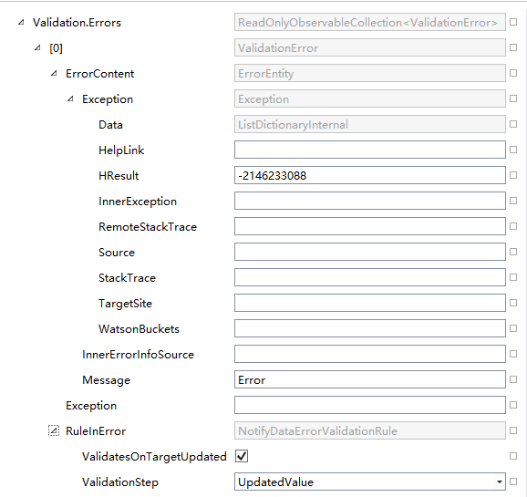

## ViewModel简介

ViewModel里面有一些属性或方法会经常用到，这里仅介绍最常用的：

| 属性或方法        | 介绍           |
| :-----------: |:-------------:|
| IsUIBusy      | 本UI是否处于忙状态 |
| StageManager      | 管理Stage      |
| Dispatcher | 当前View的Dispatcher，用于在UI线程上进行工作      |
| IsInDesignMode | 是否处于设计模式|
| ListenChanged | 支持订阅多个属性的变化合并查询 | 
| IsDisposingWhenUnbindRequired | 解除绑定时是否释放资源，默认是false |
| IsDisposingWhenUnloadRequired | 当控件被Unload时是否释放资源，默认是true |
| LocalEventRouter | 给这个模型分配的消息路由引用（延迟加载）|
| 索引器 | 根据属性名称获取属性值 |
| CopyTo | 将数据拷贝到另外一个ViewModel|

## 数据验证

BindableBase类已经实现了INotifyDataErrorInfo接口

``` CSharp
public string TestString
{
    get { return _TestStringLocator(this).Value; }
    set { _TestStringLocator(this).SetValueAndTryNotify(value); }
}

//验证
_TestStringLocator(this).GetNewValueObservable().Subscribe(ev =>
{
   if (ev.EventArgs == "")
       ev.Source.Errors.Add(new ErrorEntity() { Message = "ERROR" });
   else
       ev.Source.Errors.Clear();
});
```

`_TestStringLocator(this)` 也可以改成 `GetValueContainer(nameof(TestString))` 或 `ListenChanged` ，当然也可以写在set里代替 `GetNewValueObservable()`，也可以用Exception和InnerErrorInfoSource。

简单的获取错误信息，比如：
``` CSharp
<Setter Property="ToolTip" Value="{Binding RelativeSource={RelativeSource Self}, Path=(Validation.Errors)[0].ErrorContent.Message}"/>
```

`Validation.Errors`是`ValidationError`的一个列表，`ErrorContent`属性即以上Add的ErrorEntity，可视化树如下图



MVVMRxExtensions中有很多有用的扩展方法，比如：
``` CSharp
public static IObserver<TValue> AsObserver<TValue>(this ValueContainer<TValue> source);
```

## 导航

在重写OnBindedViewLoad时如果要导航，应该把此方法加上async标记并把base方法改成await，然后在后面加上导航后需要进行的任务。
await base.OnBindedViewLoad(view);
//TODO: Navigate Task

## 常见的问题

中间应该是进行了一次重命名，OnDisposeExceptions模板已过期应将 `IList<DisposeInfo>` 改成 `IList<DisposeEntry>`